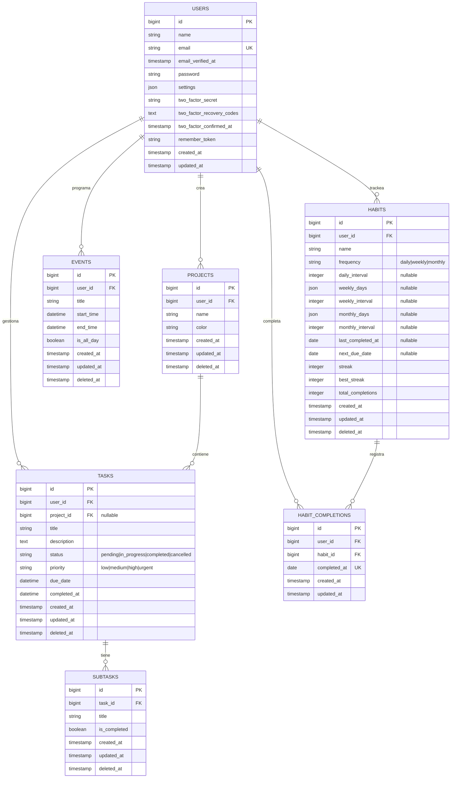

# Diagrama Entidad-Relación

## Sistema de Gestión de Tareas y Proyectos

## Descripción de Relaciones

### USERS (Usuarios)
- **1:N con PROJECTS**: Un usuario puede crear múltiples proyectos
- **1:N con TASKS**: Un usuario puede gestionar múltiples tareas
- **1:N con EVENTS**: Un usuario puede programar múltiples eventos
- **1:N con HABITS**: Un usuario puede trackear múltiples hábitos
- **1:N con HABIT_COMPLETIONS**: Un usuario registra múltiples completaciones de hábitos

### PROJECTS (Proyectos)
- **N:1 con USERS**: Cada proyecto pertenece a un usuario
- **1:N con TASKS**: Un proyecto puede contener múltiples tareas

### TASKS (Tareas)
- **N:1 con USERS**: Cada tarea pertenece a un usuario
- **N:1 con PROJECTS**: Cada tarea puede pertenecer a un proyecto (opcional)
- **1:N con SUBTASKS**: Una tarea puede tener múltiples subtareas

### SUBTASKS (Subtareas)
- **N:1 con TASKS**: Cada subtarea pertenece a una tarea

### EVENTS (Eventos)
- **N:1 con USERS**: Cada evento pertenece a un usuario

### HABITS (Hábitos)
- **N:1 con USERS**: Cada hábito pertenece a un usuario
- **1:N con HABIT_COMPLETIONS**: Un hábito tiene múltiples registros de completación

### HABIT_COMPLETIONS (Completaciones de Hábitos)
- **N:1 con USERS**: Cada completación pertenece a un usuario
- **N:1 con HABITS**: Cada completación pertenece a un hábito

## Enumeraciones

### TaskStatus (Estado de Tarea)
- `pending`: Tarea pendiente sin iniciar
- `in_progress`: Tarea en desarrollo
- `completed`: Tarea finalizada
- `cancelled`: Tarea cancelada

### TaskPriority (Prioridad de Tarea)
- `low`: Prioridad baja
- `medium`: Prioridad media
- `high`: Prioridad alta
- `urgent`: Prioridad urgente

### HabitFrequency (Frecuencia de Hábito)
- `daily`: Hábito diario
- `weekly`: Hábito semanal
- `monthly`: Hábito mensual

## Reglas de Negocio

1. **Soft Deletes**: Las entidades PROJECTS, TASKS, SUBTASKS, EVENTS y HABITS utilizan eliminación suave (soft deletes)
2. **Autenticación**: Los usuarios utilizan Laravel Fortify para autenticación con soporte para 2FA
3. **Completado Automático**: Cuando una tarea cambia a estado "completed", se establece automáticamente `completed_at`
4. **Alcance Global**: Todas las consultas están filtradas por el usuario autenticado mediante policies
5. **Cascada en Eliminación**: 
   - Al eliminar un usuario, se eliminan todos sus proyectos, tareas, eventos, hábitos y completaciones
   - Al eliminar un proyecto, sus tareas quedan sin proyecto (project_id = NULL)
   - Al eliminar una tarea, se eliminan todas sus subtareas
   - Al eliminar un hábito, se eliminan todas sus completaciones
6. **Sistema de Rachas**: Los hábitos mantienen automáticamente:
   - `streak`: Racha actual de días consecutivos
   - `best_streak`: Mejor racha histórica
   - `total_completions`: Total de completaciones registradas
7. **Completaciones Únicas**: No se pueden registrar múltiples completaciones de un hábito en la misma fecha (UNIQUE constraint)

## Índices y Restricciones

### Claves Únicas (UNIQUE)
- **users.email**: Email único por usuario
- **habit_completions(habit_id, completed_at)**: Un hábito solo puede completarse una vez por día

### Claves Foráneas (FOREIGN KEY)
- **projects.user_id**: Referencia a users.id (CASCADE ON DELETE)
- **tasks.user_id**: Referencia a users.id (CASCADE ON DELETE)
- **tasks.project_id**: Referencia a projects.id (NULL ON DELETE) - nullable
- **subtasks.task_id**: Referencia a tasks.id (CASCADE ON DELETE)
- **events.user_id**: Referencia a users.id (CASCADE ON DELETE)
- **habits.user_id**: Referencia a users.id (CASCADE ON DELETE)
- **habit_completions.user_id**: Referencia a users.id (CASCADE ON DELETE)
- **habit_completions.habit_id**: Referencia a habits.id (CASCADE ON DELETE)

### Índices Adicionales
- **sessions.user_id**: INDEX
- **sessions.last_activity**: INDEX
- **habit_completions(user_id, completed_at)**: INDEX compuesto para consultas rápidas por usuario y fecha
